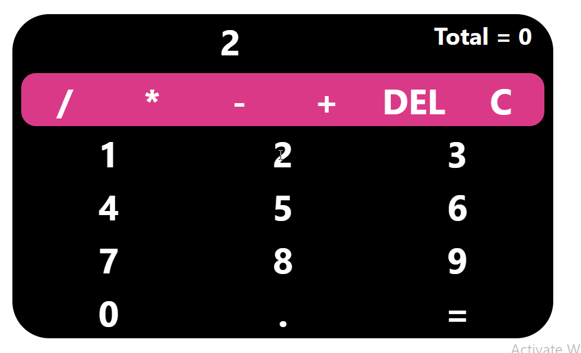

# Technology used

HTML, CSS, JavaScript, React.js,React Hooks Router, Grid System of Bootstrap.

## Project Details

### Purpose to Make Calculator

:ballot_box_with_check:Building a web calculator is a great project, especially if you have just started learning JavaScript. It is quite simple for people of any skill level. This project covers the interactions with UI and key JavaScript methods.

:ballot_box_with_check:you need to consider the basic functionalities of a calculator. They include addition, subtraction, multiplication, division, delete, all-clear, and of course, the ability to use decimal numbers in performing these operations.

### What i have learned

#### :black_nib:Interactions with UI and key JavaScript methods.
#### :black_nib:Working with user events and state to create interactive applications.
#### :black_nib:How to work with lists and conditional content.
#### :black_nib:React Hooks (in-depth)! ex. useSelector , useState, useEffect, useDispatch etc.
#### :black_nib:Class-based components and functional components.
#### :black_nib:Various HTML and CSS elements along with Basic JavaScript and modern ES6 practices used in building a functional and responsive calculator, as shown in the Gif above
#### :black_nib:Routing with React Router.
#### :black_nib:How to use Grid System of Bootstrap or React-Bootstrap
#### :black_nib:Amazing things and learning a lot along on the way.

